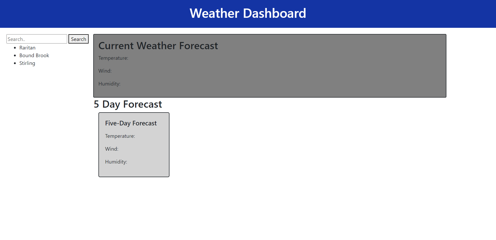

# Weather Dashoard

## Description

Users can search any city and get the forecasts for the current temperature, wind and humidity for the city along with a 5 day forecast!

## Installation

To open the Weather Dashboard app click this link: 
https://luanaparedes.github.io/Luana-Paredes-Server-Side-APIS/

## Usage 

Upon opening the app users can search and see the current forecast and a forecast for the next 5 days.

## Credits

https://getbootstrap.com/docs/4.0/layout/grid/
https://getbootstrap.com/
https://getbootstrap.com/docs/5.3/components/card/#about